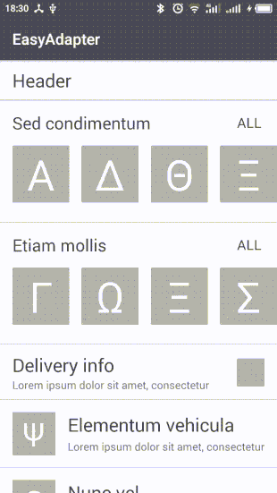

# EasyAdapter
There is demonstration of simple approach for implementation difficult lists, based on RecyclerView.

You do need call method notify... and extend RecyclerView.Adapter. 

You need only create ItemController for each type of elemets in list and describe order of elemets in Activity/Fragment.

A big thanks to  developers, especially to  , for their help in developing.

## Example 1 - Six types of elements:


Code in activity:
```kotlin
 private fun initList() {
    this.adapter = EasyAdapter()
    recycler.itemAnimator = SlideItemAnimator()
    recycler.layoutManager = LinearLayoutManager(this)
    recycler.adapter = adapter

    headerController = HeaderController()
    carouselController = CarouselController(
            onElementClickListener = { openPaginationScreen() },
            onShowAllClickListener = { openPaginationScreen() })
    deliveryController = DeliveryController(
            onClickListener =  { openPaginationScreen() })
    commercialController = CommercialController(
            onClickListener =  { openPaginationScreen() })
    elementController = ElementController(
            onClickListener = { openPaginationScreen() })
    emptyStateController = EmptyStateController()
}

fun render(screenModel: MainScreenModel) {
    val itemList = ItemList.create()
            .addIf(screenModel.hasHeader(), headerController)
            .addAll(screenModel.carousels, carouselController)
            .addIf(!screenModel.isEmpty(), deliveryController)
            .addIf(screenModel.hasCommercial, commercialController)
            .addAll(screenModel.elements, elementController)
            .addIf(screenModel.hasBottomCarousel(), screenModel.bottomCarousel, carouselController)
            .addIf(screenModel.isEmpty(), emptyStateController)
    adapter.setItems(itemList)
}
```

Example of ItemController:
```kotlin
class ElementController(
        val onClickListener: (element: Element) -> Unit
) : BindableItemController<Element, ElementController.Holder>() {

    override fun createViewHolder(parent: ViewGroup): Holder = Holder(parent)

    override fun getItemId(data: Element): Long = data.id.hashCode().toLong() //must return unique value for element

    inner class Holder(parent: ViewGroup) : BindableViewHolder<Element>(parent, R.layout.element_item_layout) {
        private lateinit var data: Element
        private val nameTv: TextView

        init {
            itemView.setOnClickListener { onClickListener.invoke(data) }
            nameTv = itemView.findViewById(R.id.name_tv)
            //find views here
        }

        override fun bind(data: Element) {
            this.data = data
            nameTv.text = data.name
            //render data here
        }
    }
}
```

## Example 2 - Loading data and pagination:


Placeholders is also element of RecyclerView

Code in activity:
```kotlin
fun render(screenModel: PaginationScreenModel) {
    val itemList = when (screenModel.loadState) {
        LoadState.LOADING -> ItemList.create(screenModel.stubs, stubController)
        LoadState.ERROR -> ItemList.create(errorStateController)
        LoadState.EMPTY -> ItemList.create(emptyStateController)
        LoadState.NONE -> ItemList.create(screenModel.elements, elementController)
    }
    adapter.setItems(itemList, screenModel.paginationState)
}
```

## License
```
Copyright 2016 Maxim Tuev

   Licensed under the Apache License, Version 2.0 (the "License");
   you may not use this file except in compliance with the License.
   You may obtain a copy of the License at

       http://www.apache.org/licenses/LICENSE-2.0

   Unless required by applicable law or agreed to in writing, software
   distributed under the License is distributed on an "AS IS" BASIS,
   WITHOUT WARRANTIES OR CONDITIONS OF ANY KIND, either express or implied.
   See the License for the specific language governing permissions and
   limitations under the License.
```

